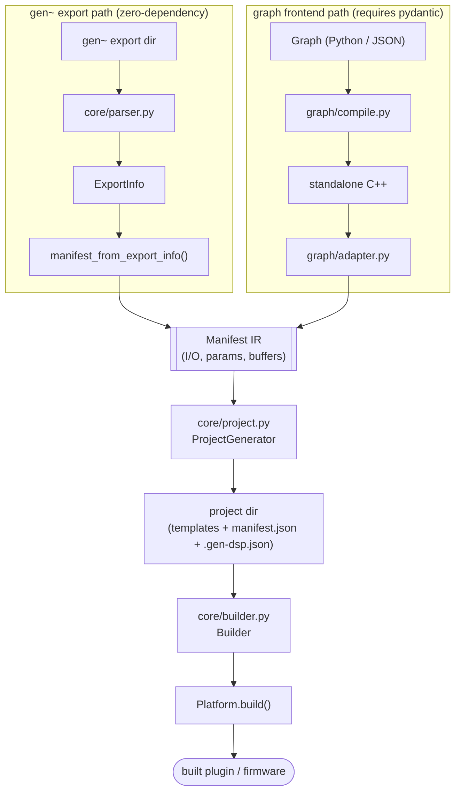
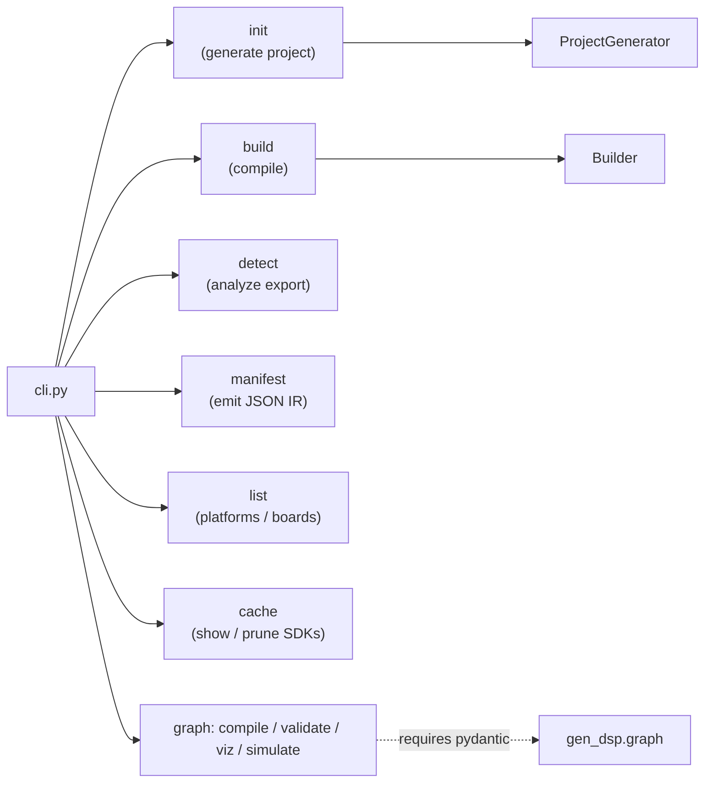
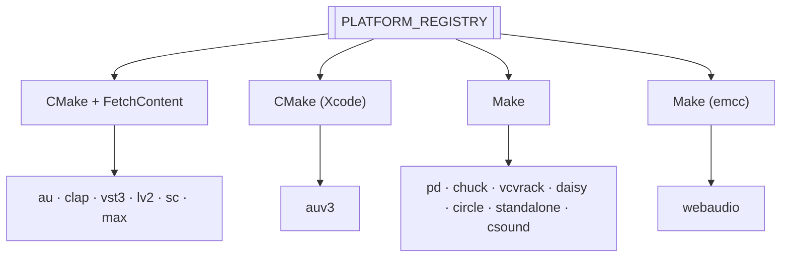
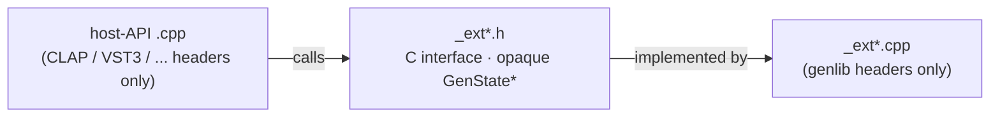

# Architecture

A visual overview of how gen-dsp turns a gen~ export (or a Python/JSON graph) into a buildable plugin project. For the prose version and conventions, see the project's `CLAUDE.md`; for the library API, see the [Core API guide](api/core-guide.md).

## Pipeline data flow

Two front ends feed a single, front-end-agnostic intermediate representation (the `Manifest`), which every platform backend consumes. The gen~ path is zero-dependency; the graph path requires pydantic.

## CLI orchestration

`cli.py` wires the pipeline into subcommands. The `graph` subcommands are only available when the `[graph]` extra is installed.

## Platform registry

`platforms/__init__.py` holds `PLATFORM_REGISTRY`, mapping a string key to a `Platform` subclass. Adding a platform is a single-module change plus a registry entry. Backends group by build system:

Each `Platform` implements `generate_project()`, `build()`, `clean()`, `find_output()`, and `get_build_instructions()`. SDKs for CMake/FetchContent and several Make backends are auto-downloaded into a shared cache.

## Header isolation pattern

Generated projects keep host-API code and genlib code in separate translation units that never include each other's headers. They communicate only through a small C interface (`_ext*.h`) over an opaque `GenState*` pointer, so the genlib sources compile without the host SDK and vice versa.

